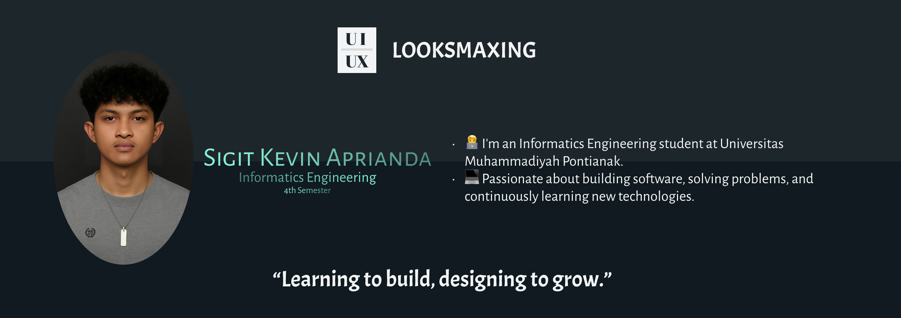

## Hi Internet!! I,m Sigit Kevin Aprianda

 
  <h3> Digital Footage Here 😈</h3>

  

### 🛠️ Tech Stack
- 🗺️ Programming: Java, PHP
- 📰 Web: HTML, CSS, JavaScript
- 🔏 Database: Mysql
- 🔧 Tools: Git, Terminal, Visual Studio Code, Figma, XAMPP, Intellij, PyCharm
#### Badge Here
##### Programming

 
 

##### Web

##### Database

##### Tools

### 📖 Currently Learning 
- Java, PHP, TypeScript
- ReactJS
- Backend Development Node.js
- Laravel
- RESTful APIs
- Graphic Design with Figma
- Front-End
- Back-End
- Full Stack Dev (Plan)

### 🤖 Ask Me About
- Martial Arts
- Culture of my hometown (Ketapang, West Kalimantan Province, Indonesia)

#### 📝 Word By Word
- -- What makes us more proficient are the requests of the clients.
- -- Seek your own freedom without depending on others. Don't be ... ah never mind.

 
  <h3> 👾PACMANNN  </h3>
  
<i>under construction</i>

 

<picture>
  <source media="(prefers-color-scheme: dark)" srcset="https://raw.githubusercontent.com/SigitKevinAprianda/SigitKevinAprianda/output/pacman-contribution-graph-dark.svg">
  <source media="(prefers-color-scheme: light)" srcset="https://raw.githubusercontent.com/SigitKevinAprianda/SigitKevinAprianda/output/pacman-contribution-graph.svg">
  
</picture>
 

<h6>她是我的日出,而我只是她的过云。</h6>

